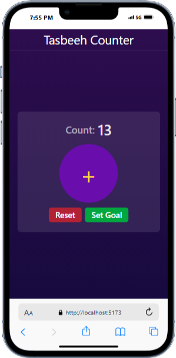
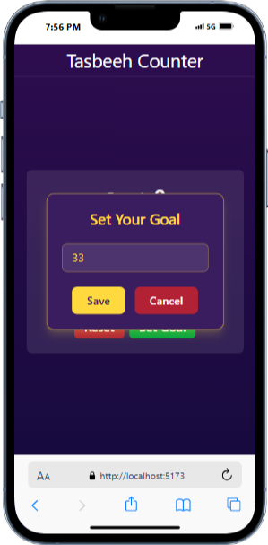
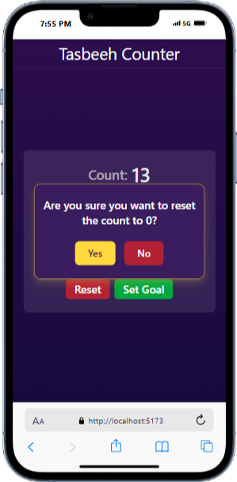

# 🕌 Digital Tasbeeh Counter

A simple yet functional **React + Tailwind CSS** Tasbeeh counter with goal-setting and reset confirmation features.  
Built as my first React project to explore **state management, conditional rendering, and responsive UI design**.

---

## 🚀 Features

- ➕ **Increment Counter** — Count with a single click.
- 🎯 **Set a Goal** — Specify a target count, and the button disables and vibrate device when reached.
- 🔄 **Reset Confirmation** — Prevent accidental resets with a confirmation modal.
- 📱 **Responsive Design** — Works on mobile, tablet, and desktop.
- 🎨 **Styled with Tailwind CSS** — Clean, modern, and customizable.

---

## 🛠️ Tech Stack

- **React** 
- **Tailwind CSS**

---

## 📸 Screenshots

| Counter View | Goal Setting | Reset Confirmation |
|--------------|--------------|--------------------|
|  |  |  |

---

## 📦 Installation

1. **Clone the repository**
   ```bash
   git clone https://github.com/yourusername/tasbeeh-counter.git
